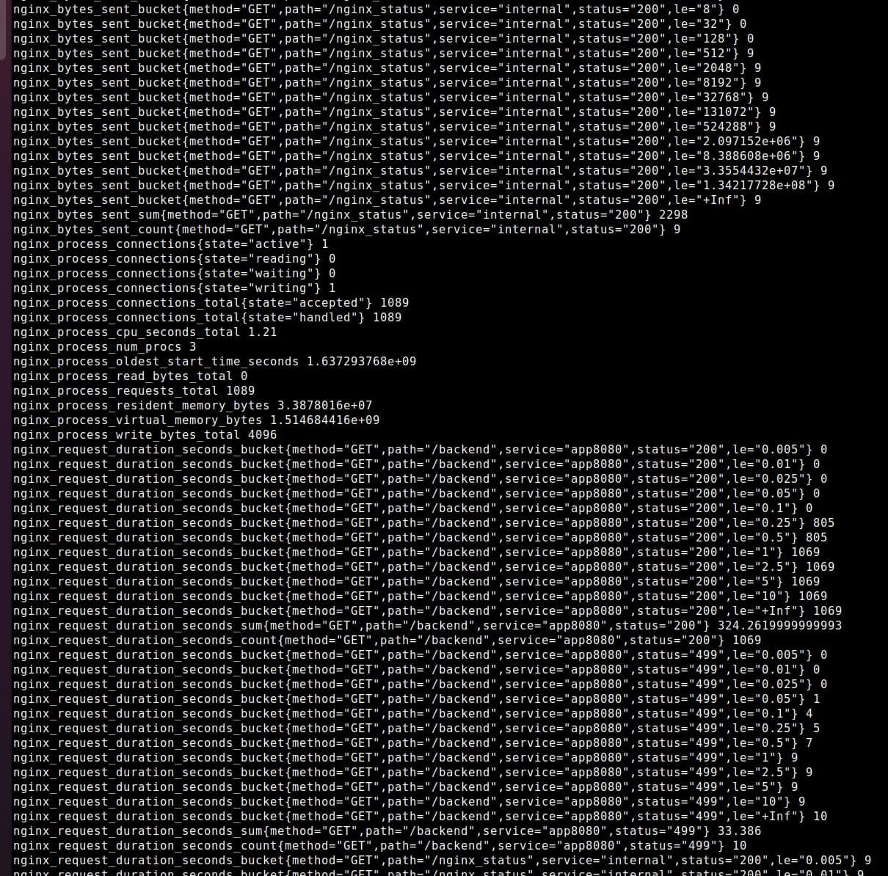

## stand-alone version of [k8s/ingress-nginx](https://github.com/kubernetes/ingress-nginx)' prometheus exporter

based on [openresty/lua-nginx-module](https://github.com/openresty/lua-nginx-module)

### how it works

exporter opens socket (/tmp/prometheus-nginx.socket) and waits for Nginx workers to send logs every second

Nginx config should have [monitor.lua](https://github.com/alex01t/prometheus-nginx-socket-exporter/blob/master/nginx/lua/monitor.lua) and [monitor.conf](https://github.com/alex01t/prometheus-nginx-socket-exporter/blob/master/nginx/conf.d/monitor.conf) from this repo

user config may be instrumented with `service_name` and `location_path` that go as labels, see example [default.conf](https://github.com/alex01t/prometheus-nginx-socket-exporter/blob/master/nginx/conf.d/default.conf)
```
server {
    set $service_name  "app8080";
    listen       8080;
    location / {
        set $location_path  "/backend";
        proxy_pass http://backend;
    }
```
### how to run

    docker build . -t r
    docker run -it -p8080:8080 -p10254:10254 r
    
nginx -- http://localhost:8080/debian/doc/

metrics -- http://localhost:10254/metrics




### this exporter metric list
    curl -s 127.0.0.1:10254/metrics |grep -v ^# | cut -d'{' -f1|cut -d' ' -f1 | sort | uniq
    
    nginx_bytes_sent_bucket
    nginx_bytes_sent_count
    nginx_bytes_sent_sum
    nginx_process_connections
    nginx_process_connections_total
    nginx_process_cpu_seconds_total
    nginx_process_num_procs
    nginx_process_oldest_start_time_seconds
    nginx_process_read_bytes_total
    nginx_process_requests_total
    nginx_process_resident_memory_bytes
    nginx_process_virtual_memory_bytes
    nginx_process_write_bytes_total
    nginx_request_duration_seconds_bucket
    nginx_request_duration_seconds_count
    nginx_request_duration_seconds_sum
    nginx_requests
    nginx_request_size_bucket
    nginx_request_size_count
    nginx_request_size_sum
    nginx_response_duration_seconds_bucket
    nginx_response_duration_seconds_count
    nginx_response_duration_seconds_sum
    nginx_response_size_bucket
    nginx_response_size_count
    nginx_response_size_sum
    nginx_upstream_latency_seconds
    nginx_upstream_latency_seconds_count
    nginx_upstream_latency_seconds_sum

### nginx-ingress metrics list

    nginx_ingress_controller_bytes_sent_bucket
    nginx_ingress_controller_bytes_sent_count
    nginx_ingress_controller_bytes_sent_sum
    nginx_ingress_controller_config_hash
    nginx_ingress_controller_config_last_reload_successful
    nginx_ingress_controller_config_last_reload_successful_timestamp_seconds
    nginx_ingress_controller_ingress_upstream_latency_seconds_count
    nginx_ingress_controller_ingress_upstream_latency_seconds_sum
    nginx_ingress_controller_nginx_process_connections
    nginx_ingress_controller_nginx_process_connections_total
    nginx_ingress_controller_nginx_process_cpu_seconds_total
    nginx_ingress_controller_nginx_process_num_procs
    nginx_ingress_controller_nginx_process_oldest_start_time_seconds
    nginx_ingress_controller_nginx_process_read_bytes_total
    nginx_ingress_controller_nginx_process_requests_total
    nginx_ingress_controller_nginx_process_resident_memory_bytes
    nginx_ingress_controller_nginx_process_virtual_memory_bytes
    nginx_ingress_controller_nginx_process_write_bytes_total
    nginx_ingress_controller_request_duration_seconds_bucket
    nginx_ingress_controller_request_duration_seconds_count
    nginx_ingress_controller_request_duration_seconds_sum
    nginx_ingress_controller_requests
    nginx_ingress_controller_request_size_bucket
    nginx_ingress_controller_request_size_count
    nginx_ingress_controller_request_size_sum
    nginx_ingress_controller_response_duration_seconds_bucket
    nginx_ingress_controller_response_duration_seconds_count
    nginx_ingress_controller_response_duration_seconds_sum
    nginx_ingress_controller_response_size_bucket
    nginx_ingress_controller_response_size_count
    nginx_ingress_controller_response_size_sum
    nginx_ingress_controller_success
